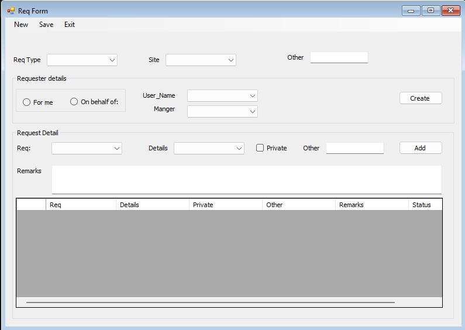

# 🏢 IT Request Management System (ORASCOM)



<div align="center">
  
  
  
  
  

  [](https://github.com/stevenashrafkamal/IT-Request-ORASCOM-Project/actions/workflows/dotnet.yml)
</div>


<br>

**An Enterprise Workflow Automation Platform**

This project is a robust, centralized system developed to streamline, manage, and automate internal IT requests and ticketing workflows for ORASCOM. The core engine is built entirely on the **.NET framework**, providing a secure, scalable, and high-performance backend architecture that processes business logic and data management.

---


## 🚀 Architecture & Tech Stack

The system is designed with a strong emphasis on Layered Architecture, strictly separating the core business logic from the presentation layer.

### ⚙️ The Core Engine (Backend API)
* **Framework:** ASP.NET (C#)
* **Architecture:** MVC / Web API Layered Architecture
* **Database:** MS SQL Server
* **ORM:** Entity Framework (EF - Database First via `.edmx`)
* **Security:** Role-Based Access Control (RBAC) and secure data transactions.

### 🖥️ The Client Application (Frontend Desktop)
* **Technology:** VB.NET (Windows Forms)
* **Purpose:** Serves as a lightweight, intuitive desktop user interface that consumes and interacts with the powerful .NET core services to display data and manage workflows for end-users.

---

## ✨ Key Features

* **Workflow Automation:** Automates the lifecycle of an IT request from creation to resolution, reducing manual overhead.
* **State Management:** Tracks request statuses (Pending, In Progress, Resolved) with precise timestamping and auditing.
* **Data Integrity & Validation:** Strict backend validation ensures that no corrupt or incomplete data enters the enterprise database.
* **Role Management:** Distinct permission levels for standard employees and IT Administrators.
* **Optimized Queries:** Efficient database querying using Entity Framework to handle large volumes of enterprise requests seamlessly.

---

## 📂 Project Structure

Here is the precise architectural layout of the solution, showcasing the separation between the C# Backend and the VB.NET Client:

```text
IT-Request-ORASCOM-Solution/
│
├── steven_ashraf/                 # Backend (ASP.NET C# Core Engine)
│   ├── App_Start/                 # RouteConfig, BundleConfig, etc.
│   ├── Controllers/               # API & MVC Controllers handling requests
│   │   ├── AccountController.cs
│   │   ├── HomeController.cs
│   │   ├── requstController.cs
│   │   ├── ValuesController.cs
│   │   ├── UserModel.cs           # Data structures
│   │   ├── RequestModel.cs
│   │   └── docModel.cs
│   ├── Models/                    # Domain models and business entities
│   ├── Providers/                 # Security and Authentication providers
│   ├── Results/                   # Custom action results
│   ├── Views/                     # Razor views for backend dashboards
│   ├── Global.asax                # Application-level events
│   ├── Model1.edmx                # Entity Framework Data Model 
│   ├── Startup.cs                 # OWIN configuration
│   └── Web.config                 # SQL Server connection and app settings
│
└── NSFF/                          # Frontend (VB.NET Windows Forms Client)
    ├── App.config                 # Desktop client configuration
    ├── ConnectionMDL.vb           # Database/API connection module
    ├── Login.vb                   # Authentication UI Form
    ├── loginFunction.vb           # Authentication logic
    ├── Menu.vb                    # Main Dashboard/Navigation Form
    ├── PubFunMdl.vb               # Public utility functions module
    ├── reqFrm.vb                  # IT Request Submission Form
    └── packages.config            # NuGet dependencies for the client
```
## 🛠️ Installation & Setup
To run this enterprise application locally, you will need Visual Studio and SQL Server.

1. Database & Backend Setup
Clone the repository:

```Bash
git clone [https://github.com/stevenashrafkamal/IT-Request-ORASCOM-Project.git](https://github.com/stevenashrafkamal/IT-Request-ORASCOM-Project.git)
```
Open the .sln solution file in Visual Studio.

Right-click the Solution and select Restore NuGet Packages.

Open the Web.config file in the steven_ashraf project and update the Connection String to point to your local SQL Server instance.

If using Entity Framework Migrations, run the following in the Package Manager Console:

```PowerShell
Update-Database
```
(Note: As the project uses Model1.edmx, you may alternatively generate the database from the model directly).
5. Set the steven_ashraf project as the Startup Project and run it to host the backend services.

2. Client Application Setup
Ensure the Backend project is running.

Inside Visual Studio, open the NSFF (VB.NET) project.

Check the ConnectionMDL.vb or App.config to ensure the API endpoint or connection configurations point to your local environment.

Set NSFF as the Startup Project (or run multiple startup projects) and launch the desktop application.
## 👨‍💻 Developer
Steven Ashraf Kamal | Full-Stack Developer (.NET | MEAN Stack)

Computer Science Student at Minya University
